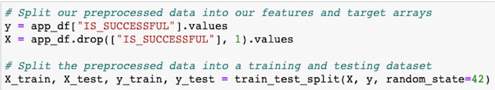
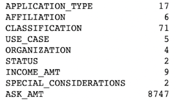
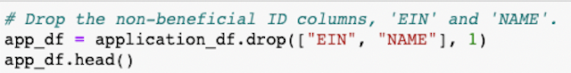
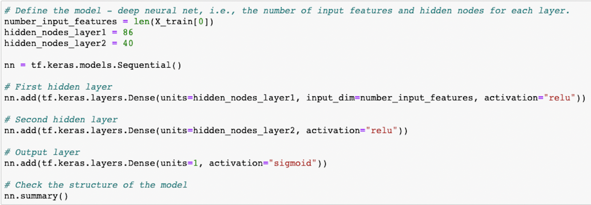
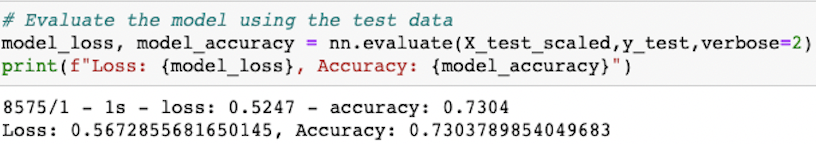
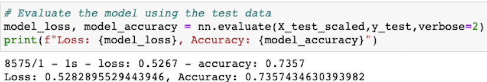
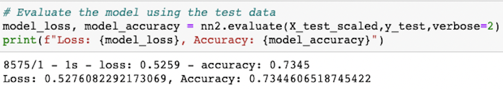
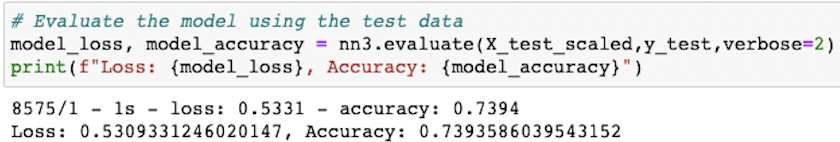

# The Giving Network
## Overview
Alphabet Soup's business team has a list of 34,000 orgainzations that have previously received funding. Using this dataset, I will help Alphabet Soup decide where to make investments by creating a binary classifier to predict what organization will be the most succesful if they receive funding. 

---
## Results
### *Data Preprocessing*
* Since the goal of the model is to predict which organizations will be the most succesful if they are given funding, the target variable is the IS_SUCCESSFUL column:

    

* The features for the model are the remaining variables excluding the ones I will later remove since they're not as important for making the predictions:

    

    The majority of the variables  are categorical and will need to be encoded to numerical values to run the model. While most of those categorical variables have less than 10 unique values, the APPLICATION_TYPE and CLASSIFICATION variables have more unique values and need to be bucketed into less categories before encoding. 

* Two of the variables will be removed from the model:

    

    I removed the EIN and NAME variables from the input data since they were neither targets nor features.

### *Compiling, Training, and Evaluating the Model*
* With the encoded variables, the model had 43 different input variables, so I decided to start out with two layers with the first layer having twice the amount of neurons as input variables:

    

    The first hidden layer had 86 neurons and the second hidden layer had 40 neurons. Both layers used the ReLu activation function since this function is ideal for dealing with positive nonlinear input data for classification. 

* To compare the performance of the model to the target performance, I used the evaluate method to calculate the accuracy of the model:

    

    The accuracy of the model of 73.04% was just under the target model performance of 75%.

* I took several steps to increase the performance of the model. First, I kept the NAME variable and included it among the feature variables after bucketing the lesser used values and encoding the remaining values. Second, I decreased the number of buckets for the APPLICATION_TYPE variable. Third, I increased the number of hidden layers from 2 to 3. Fourth, I set the neurons of the first hidden layer to 50, the second hidden layer to 25 and the third hidden layer to 12. Fifth, I used the dropout method at 20% to prevent overfitting and generate decent representational power from the model. However, I did use the ReLu activation function like I did in the original model. The first optimization attempt also did not meet the target model performance:

    

    The model improved slightly to an accuracy of 73.57% but still did not meet the target model performance.

    For the second optimization attempt, I only decreased the neurons to 25, 12 and 6 for the first hidden layer, second hidden layer and third hidden layer, respectively:

    

    Unfortunately, the accuracy of the model dropped slightly to 73.45%.

    For the third optimization attempt, I increased the neurons to 86, 40 and 20 as well as increasing the dropout percentage to 30% and changing to the tanh activation function:

    

    While the model had the best performance out of all the models so far with an accuracy of 73.94%, it was still not a good enough model to hit my accuracy target.

---
## Summary
After several optimization attempts, the model was not able to achieve the target model performance of 75%. All the models did have accuracies between 73% and 74% but topped out at just under 74%. Another model may be needed to future improve the accuracy and reach the 75% target. The random forest classifier may be a useful option since it breaks down the data to a subset of the features to create many simple decision trees. Combining all these simple decision trees may help build a more accurate model. 